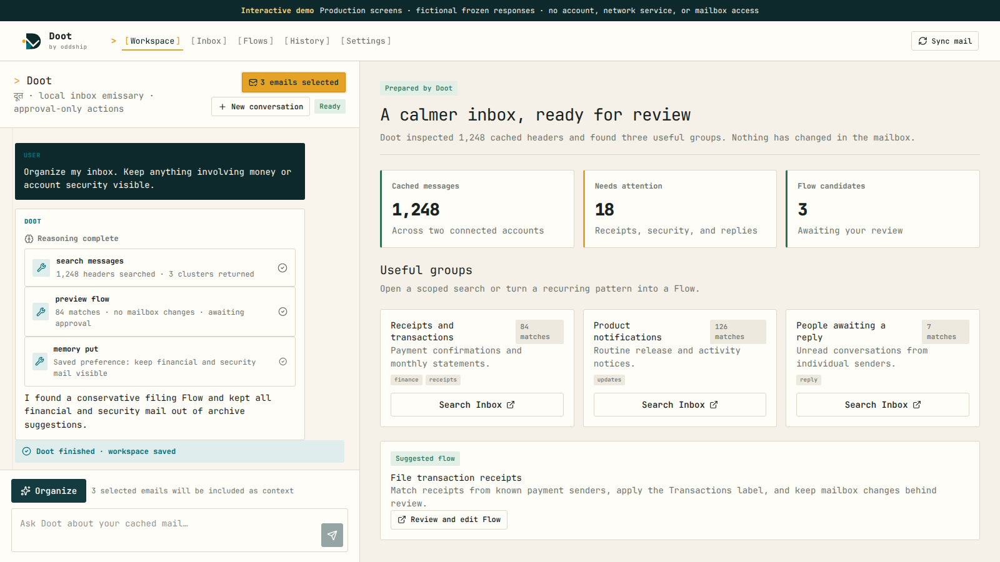

<p align="center">
  
</p>

<p align="center"><strong>A trusted, local-first emissary for your inbox.</strong></p>

<p align="center"><a href="https://oddship.github.io/doot/demo/"><strong>Try the frozen demo →</strong></a></p>

<p align="center">
  <a href="https://oddship.github.io/doot/demo/"></a>
</p>

Doot is an agent-first email workspace that investigates a local IMAP cache, builds useful views, and prepares reviewable actions. It never silently mutates your mailbox: archive, move, delete, folder, and Flow operations cross an explicit browser confirmation boundary.

> Doot is an early v0.1 release. Run it locally, keep backups, and review every proposed mailbox action.

## What it does

- Connects IMAP accounts, discovers provider folders, and incrementally syncs message headers.
- Searches the complete cache with SQLite FTS5 and fetches bodies only when opened via `BODY.PEEK[]`.
- Gives the agent paginated search, aggregation, selected-message, proposal, Flow, artifact, and bounded memory tools.
- Streams agent reasoning and tool progress into a persistent workspace that survives navigation.
- Generates safe component specs—never model-authored HTML, CSS, URLs, or event handlers.
- Replays agent sessions and sync jobs from History.

## Quick start

Requirements: Node.js 22 or 23, npm, and a provider API key for agent features.

```bash
cp .env.example .env
npm ci
npm run dev
```

Open <http://127.0.0.1:8765>, add an account in Settings, test it, and sync. Doot stores account credentials and cached mail in the local SQLite database configured by `DOOT_DATABASE_PATH`; protect that file and never commit it.

With Nix and direnv:

```bash
direnv allow
just setup
just dev
```

With Docker:

```bash
docker compose up --build
```

The Compose volume `doot-data` retains the SQLite database. See [configuration](docs/04-reference/01-configuration.md) before exposing the container beyond localhost.

## Development

```bash
just check       # lint, type-check, and unit/contract tests
just build       # production build
just ui-check    # screenshot and widescreen regression audit; server must be running
just audit       # production dependency audit
```

Pre-commit hooks run Biome through lint-staged. Run `npm run prepare` after cloning if npm did not install hooks automatically.

## Architecture

```text
Browser ── Next.js + React ── SQLite/FTS5
   │             ├────────── Pi agent runtime
   │             └────────── ImapFlow ── IMAP
   └── SSE (agent run) + WebSocket (background status)
```

One Node process owns Next.js, the Pi runtime, SQLite, IMAP operations, API routes, SSE, and WebSocket events. There is no Python service. See the [architecture guide](docs/03-development/01-architecture.md) and [codebase map](docs/03-development/02-codebase.md).

## Safety model

- Organization is manually initiated; sync and startup do not trigger the model.
- Generated workspaces contain validated primitives and validated action intents.
- The agent creates local proposals; only browser-confirmed endpoints apply mailbox writes.
- Generated organization workspaces may suggest deletion, but deletion remains a manual Inbox proposal and confirmation flow.
- Remote images are blocked by default; HTML is sanitized and rendered in a sandboxed iframe.
- Doot is local-only and has no authentication in v0.1.

Read the complete [safety model](docs/01-guide/02-safety-model.md) and [security policy](SECURITY.md).

## Documentation

The source in [`docs/`](docs/) is published with [Oddship Moat](https://github.com/oddship/moat) at <https://oddship.github.io/doot/>. Product scope and decisions live in the [v0.1 product specification](docs/02-product/01-product-spec.md).

The [frozen demo](https://oddship.github.io/doot/demo/) is a real Next.js static export generated reproducibly from Doot's production screen components and versioned, fictional API responses by `npm run demo:build`. It contacts no external service and has no mailbox access. Run it locally with `npm run demo:serve`, and regenerate its README screenshot with `npm run demo:screenshot`.

## Contributing

Read [CONTRIBUTING.md](CONTRIBUTING.md). By participating, you agree to follow the [Code of Conduct](CODE_OF_CONDUCT.md).

## License

MIT © Oddship contributors. See [LICENSE](LICENSE).
